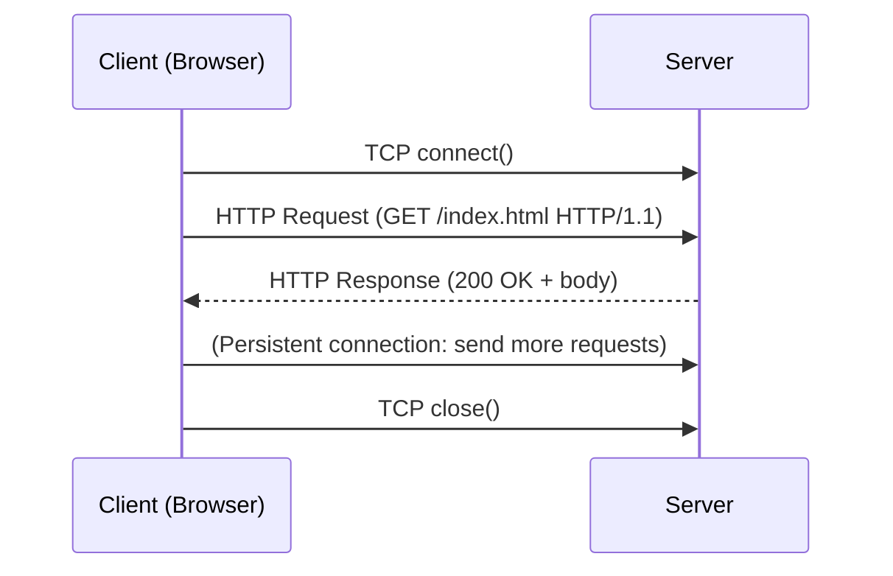

# CSE333: HTTP

The **Hypertext Transfer Protocol (HTTP)** is an application-level request/response protocol that dictates how web browsers and web servers communicate. It is implemented on top of TCP streams.

## HTTP Basics



1. A client establishes one or more TCP connections to a server.
2. The client sends a **request** for a resource, identified by a **URI** (Uniform Resource Identifier).
3. The server sends a **response** containing the resource or an error message.

## HTTP Requests

```http
[METHOD] [request-uri] HTTP/[version]
[headerfield1]: [fieldvalue1]
[headerfield2]: [fieldvalue2]
...
(blank line)
[request body, if any]
```

### Common Methods

- **GET**: Request a named resource. No body.
- **POST**: Submit data to the server (e.g., form submission, file upload).
- **HEAD**: Request only the headers for a resource — useful for checking if a cached copy is still valid without downloading the full body.

### Client Headers

- **`Host`**: The DNS name of the server. Required in HTTP/1.1.
- **`User-Agent`**: Identifying string for the client application (browser, curl, etc.).
- **`Accept`**: Content types the client prefers (e.g., `text/html, application/json`).
- **`Cookie`**: HTTP cookie previously set by the server.

## HTTP Responses

```http
HTTP/[version] [status code] [reason phrase]
[headerfield1]: [fieldvalue1]
...
(blank line)
[response body, if any]
```

### Status Codes

- **1xx**: Informational message.
- **2xx**: Success (e.g., `200 OK`).
- **3xx**: Redirect (e.g., `301 Moved Permanently`, `302 Found`).
- **4xx**: Client error (e.g., `400 Bad Request`, `404 Not Found`).
- **5xx**: Server error (e.g., `500 Internal Server Error`).

### Server Headers

- **`Server`**: String identifying the server software (e.g., `nginx/1.18.0`).
- **`Content-Type`**: MIME type of the response body (e.g., `text/html`, `application/json`).
- **`Content-Length`**: Size of the response body in bytes.
- **`Last-Modified`**: Date and time the resource was last changed.

## HTTP/1.1 Features

- **Chunked Transfer-Encoding**: Allows the server to start sending a response before it knows the total size — useful for dynamically generated content.
- **Persistent Connections**: Multiple requests can be sent over a single TCP connection, reducing the overhead of repeated TCP handshakes.

## HTTP/2

Standardized in 2015, HTTP/2 is a **binary protocol** (easier for machines to parse than text-based HTTP/1.1) with several performance improvements:

- **Multiplexing**: Multiple independent data streams are interleaved on a single TCP connection, eliminating head-of-line blocking.
- **Header Compression**: HTTP headers are compressed using HPACK, reducing overhead for repeated requests.
- **Server Push**: The server can proactively send resources the client will likely need.

## Related

- [[Networking Intro|Networking Intro]]
- [[DNS|DNS]]
- [[TCP Sockets|TCP Sockets]]
- [[HTTP - Protocol Mechanics and Evolution|CSE461: HTTP]]

## Industry Standard Terms

- **HTTP** — HyperText Transfer Protocol; the foundation of the World Wide Web; stateless by design (cookies and sessions add state on top)
- **URI** — Uniform Resource Identifier; the full path identifying a resource (e.g., `https://example.com/page?q=1`); a URL is a specific type of URI
- **MIME type** — "Multipurpose Internet Mail Extensions"; identifies the content type of a response (e.g., `text/html`, `image/png`, `application/json`)
- **Persistent connection** — HTTP/1.1 default behavior; keeps the TCP connection alive after a response for subsequent requests (HTTP/1.0 closed the connection after each response)
