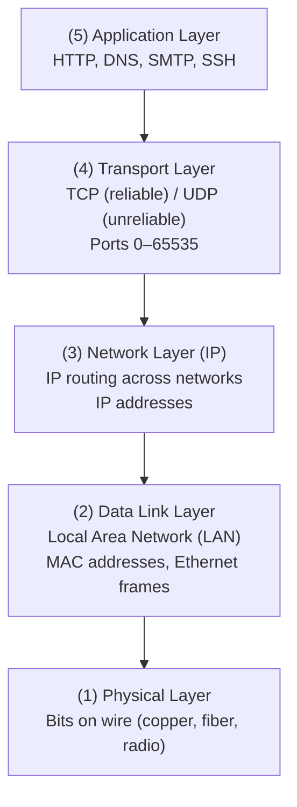

# CSE333: Networking Intro

Networking in CSE333 focuses on the **Client-Server Model**, where a client application establishes a connection to a server to request resources or services.

## The OSI Model Layers

Modern networking is built on a series of abstraction layers, each responsible for a distinct aspect of communication:

1. **Physical Layer**: Individual bits are modulated onto a physical medium (copper wire, optical cable, radio).
2. **Data Link Layer**: Multiple computers on a **Local Area Network (LAN)** contend for the medium. Data is packetized into **frames** and devices are addressed using **Media Access Control (MAC)** addresses.
3. **Network Layer (IP)**: The **Internet Protocol (IP)** routes packets across multiple networks. Every computer has a unique IP address. Routers span networks to forward packets closer to their destination.
4. **Transport Layer (TCP/UDP)**:
    - **Transmission Control Protocol (TCP)**: Provides reliable, ordered, congestion-controlled byte streams. It uses **ports** (0–65,535) to identify specific applications on a host.
    - **User Datagram Protocol (UDP)**: A thin layer providing unreliable, unordered packet delivery. Lower overhead than TCP.
5. **Application Layer**: Defines the format and meaning of messages between application entities (e.g., [[HTTP|HTTP]], [[DNS|DNS]], SMTP, SSH).

## Packet Encapsulation

As data moves down the stack, each layer wraps the higher-layer's data with its own header:

- **Application Data** → wrapped in a **TCP Header** (Transport Layer)
- **TCP Segment** → wrapped in an **IP Header** (Network Layer)
- **IP Packet** → wrapped in an **Ethernet Header/Trailer** (Data Link Layer)

On the receiving end, each layer "unwraps" its respective header to pass the payload up to the next layer.

## Popular Application Protocols

- [[DNS|DNS]]: Translates domain names (e.g., `google.com`) into IP addresses.
- [[HTTP|HTTP]]: Web protocol for requesting and receiving resources.
- **SMTP/IMAP/POP**: Mail delivery and access protocols.
- **SSH**: Secure remote login protocol.
- **BitTorrent**: Peer-to-peer file sharing.

## Tools

- **netcat (`nc`)**: A networking utility for reading from and writing to network connections using TCP or UDP.
  - Connect: `nc <IPaddr> <port>`

## Related

- [[DNS|DNS]]
- [[HTTP|HTTP]]
- [[TCP Sockets|TCP Sockets]]
- [[Concurrency Intro|Concurrency Intro]]
- [[POSIX IO|POSIX IO]]

## Industry Standard Terms

- **OSI Model** — Open Systems Interconnection model; the 7-layer conceptual framework for network protocols (CSE333 covers layers 1–5 in practice)
- **TCP/IP Stack** — The actual protocol suite used on the internet; often called the "Internet model" with 4 layers (Link, Internet, Transport, Application)
- **Port** — A 16-bit number identifying a specific application or service on a host; well-known ports include 80 (HTTP), 443 (HTTPS), 22 (SSH)
- **MAC address** — A hardware identifier burned into a network interface; operates at the Data Link Layer; not routable across the internet
