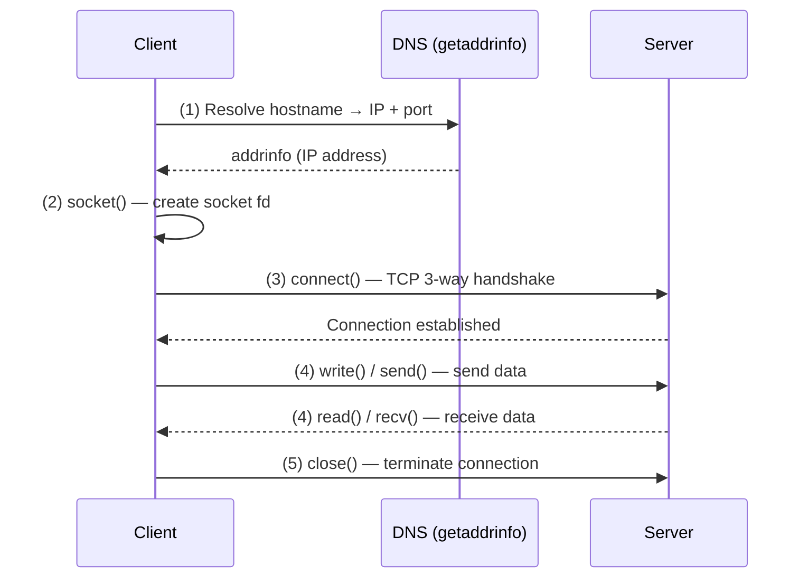

# CSE333: TCP Sockets

The **Berkeley Sockets** API is the standard API for network programming, originating in 4.2BSD Unix. UNIX treats network communications as file I/O, using **file descriptors** called **sockets**.

## Client TCP Connection Steps

Connecting to a server involves five main steps:



1. **Find IP/Port**: Use [[DNS|DNS]] (specifically `getaddrinfo`) to find the address and port.
2. **Create Socket**: Use the `socket()` system call.
3. **Connect**: Use `connect()` to establish a TCP connection to the remote server.
4. **Communicate**: Use `read()` and `write()` (or `send()` and `recv()`) to exchange data.
5. **Close**: Use `close()` to shut down the connection and free resources.

## Linux Socket API

### socket()

```c
int socket(int domain, int type, int protocol);
```

- **domain**: `AF_INET` (IPv4) or `AF_INET6` (IPv6).
- **type**: `SOCK_STREAM` (TCP) or `SOCK_DGRAM` (UDP).
- **protocol**: Usually `0` (let the OS choose based on type).
- **Returns**: A file descriptor, or `-1` on error.

### connect()

```c
int connect(int sockfd, const struct sockaddr* addr, socklen_t addrlen);
```

- Establishes a connection to the remote host. This is a **blocking** call by default and involves the TCP 3-way handshake (~2 round trips across the network).
- **Returns**: `0` on success, `-1` on error.

## Network Byte Order

Computers may use different **endianness**. The network standard is **Big Endian**. Always convert multi-byte integers before sending over the network:

- **Host to Network**: `htons()` (16-bit), `htonl()` (32-bit).
- **Network to Host**: `ntohs()` (16-bit), `ntohl()` (32-bit).

## Address Structures

- **`struct sockaddr`**: Generic address structure used by system calls. Functions accept a `sockaddr*` and `addrlen` so they can work with both IPv4 and IPv6.
- **`struct sockaddr_in`**: IPv4-specific structure containing `sin_family`, `sin_port`, and `sin_addr`.
- **`struct sockaddr_in6`**: IPv6-specific structure.
- **`struct sockaddr_storage`**: Large enough to hold either IPv4 or IPv6 structures. Commonly used to allocate space before the address family is known, then cast to `struct sockaddr*`.

## Socket I/O

- **`read()`**: Returns data already received by the network stack. If no data is waiting, it **blocks**. Returns `0` if the connection is closed (EOF). Short reads are possible — use a read loop.
- **`write()`**: Enqueues data in the OS send buffer. If the buffer is full, it **blocks**. The OS transmits the data in the background. Short writes are possible on non-blocking sockets.
- **`close()`**: Sends a FIN to the peer and shuts down the socket on both ends.

## Related

- [[Networking Intro|Networking Intro]]
- [[DNS|DNS]]
- [[HTTP|HTTP]]
- [[POSIX IO|POSIX IO]]
- [[Transport Layer - Transmission Control Protocol (TCP)|CSE461: TCP]]

## Industry Standard Terms

- **Berkeley Sockets** — The POSIX socket API; the universal interface for network I/O on Unix-like systems; also available on Windows as "Winsock"
- **Socket** — A bidirectional communication endpoint identified by an (IP address, port, protocol) triple; represented as a file descriptor in Unix
- **TCP 3-way handshake** — The SYN → SYN-ACK → ACK sequence that establishes a TCP connection; `connect()` blocks until this completes
- **Network Byte Order** — Big-endian byte ordering required by all TCP/IP headers; must convert host integers with `htons()`/`htonl()` before transmission
